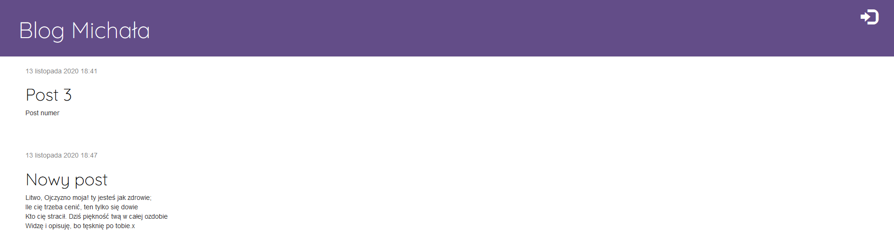
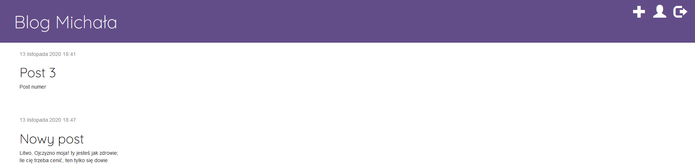
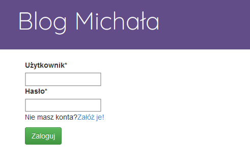
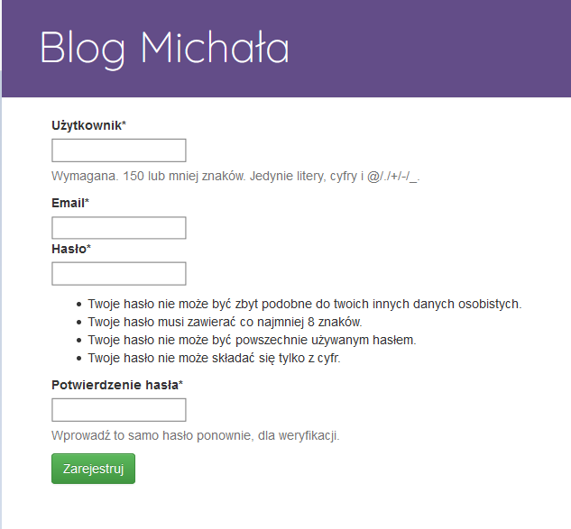
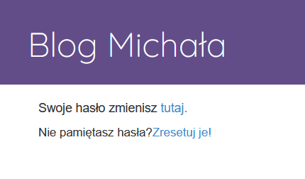
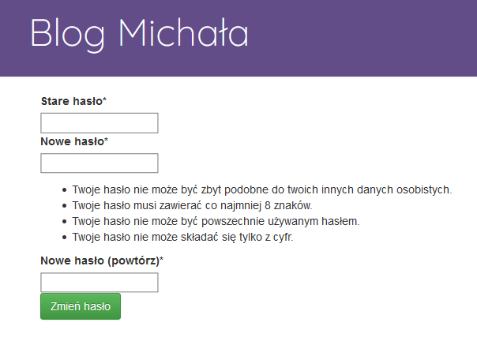
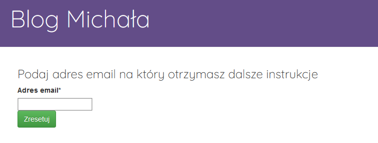
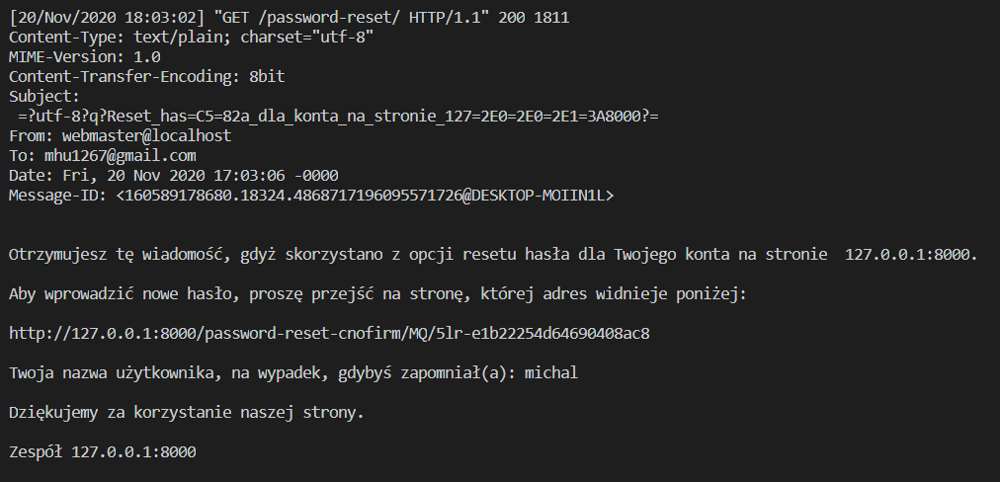

# Aplikacje Internetowe

## Lab 1
Podczas laboratoriów stworzono blog umieszczony na platformie typu PaaS. W tym wypadku było to Heroku.
W ramach bloga zrealizowano następujące zagadnienia:
 - instalacja pakietów i tworzenie projektu,
 - korzystanie z serwera deweloperskiego,
 - modele, migracje i ORM,
 - ustawienia projektu,
 - tworzenie superusera i panel admina,
 - tworzenie aplikacji w Django,
 - QuerySets i menadżery obiektów,
 - praca z plikami views.py, urls.py i szablonami,
 - praca z formularzmi (dodawanie posta, edycja istniejącego posta).
 
Stworzony blog znajduje się pod adresem https://blog-smolenski.herokuapp.com/
 
## Lab 2
W ramach laboratiorów rozbudowano poprzednią aplikację o funkcję logowania, rejestracji oraz zaminy i resetu hasła.

Zrealizowano:
 - widoki ‘login’ i ‘logout’
 - widok od zmiany hasła
 - widok od resetu hasła
 - widok realizujący rejestrację użytkownika.
 Niestety strony nie udało się umieścić w serwisie Heroku.
 
 Witryna przed zalogowaniem daje dostęp użytkownikowi tylko do przeglądania postów oraz możliwość zalogowania lub rejestracji
 
 Widok przed zalogowaniem:
 
 
 Widok po zalogowaniu
 
 
 Widok logowania
 

 Rejestracji logowania
 

 Panel użytkownika z odnośnikami do zmiany i resetu hasła
 

 Zmiana hasła
 
 
  Reset hasła
 
 
 Mail który zostałby wysłany do użytkownika
 
 
